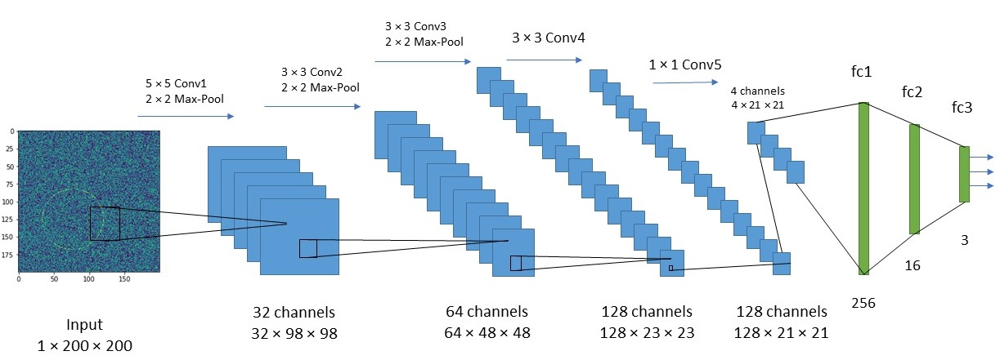
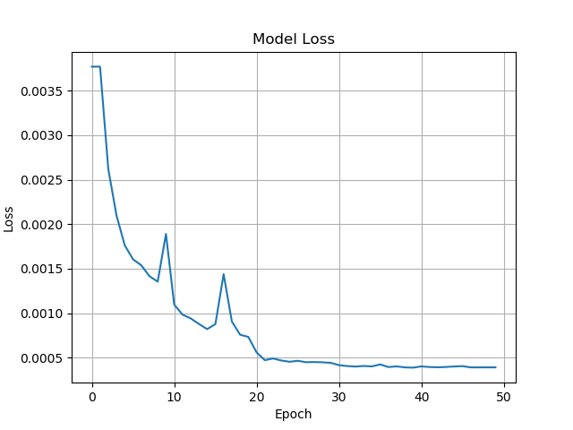

# Cirlcle-Detection-DNN
This is a PyTorch implementation of a Deep Convolutional Neural Network model for detecting the parameters of a circle present inside a given image of 200x200 pixels under the presence of random noise and blurriness. 

Note: This implementation is using Multi-GPUs for faster training. You can modify train.py to avoid using GPUs.


# Network Architecture



The output of the network is 3 real numbers which represents the detected row, column, and radious of the circle in the noisy image, it also creates a red detected circle on top of the image. 


# Model training
- Data set making
Before trainig, train set should be created by the following command:

```shell
python dataset.py
```
This will generate 1000 images with randon level of noise and blur. You can create your own train set with arbitrary number of images and arbitrary level of noise and blur by changing number of images and salt and pepper probalility of noise, and the kernel size of blur in the noisy_circle() function.

- Training:

```shell
python train.py
```
You can use your own data set by changing the default dataset by the following command:

```shell
python train.py --data {directory path to your csv train set}
```

- Resume training from a saved model:

You are able to resume training your model from a saved checkpoint by running the following:

```shell
python train.py --resume {directory path to your saved model}
```

You can also change other attributes such as batch size, learning rate, number of epochs, number of workers, resume
and continue training from a checkpoint. List of selectable attributes:

'--name', '--out_file', '--workers', '--batch-size', '--resume', '--data', '--print_freq', '--epochs', '--start_epoch', '--save_freq'

# Model Testing

You can test your model on a random image using the find_circle_cnn(img, filename, dir) function in validation.py. Run the find_circle_cnn(img, filename, dir) function with the image array as the img parameter and the filename save directory of the output detected image.


# Traing Loss
Losses for trainig the model will be saved in the `out.txt` file. Trinig loss of 50 epochs is as follows:



# Thanks to https://github.com/hsouri for the source code of this CNN.

The original repository can be found here: https://github.com/hsouri/Circle-Detection-CNN


