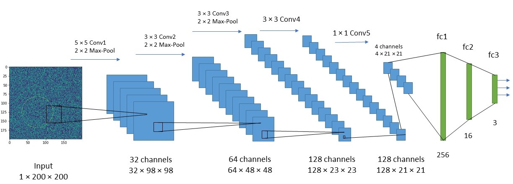
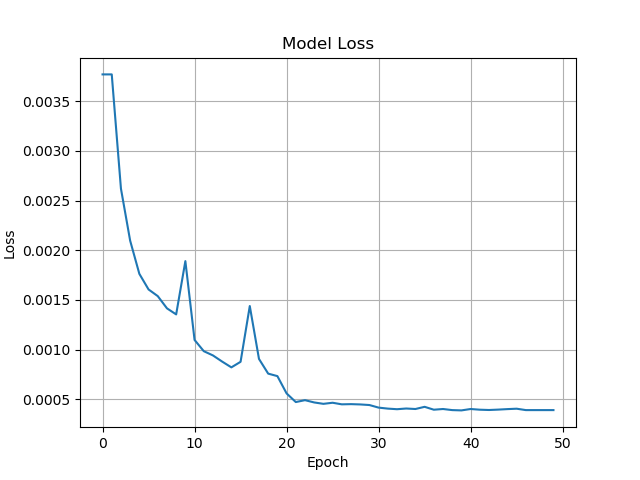

# Circle Detection: CNN vs Hough Transform

This project compares a **Deep Convolutional Neural Network (CNN)** and a **classical Hough Circle Transform** for detecting circles in noisy images. The goal is to evaluate the trade-offs between **accuracy, robustness, and execution speed** across both approaches.

---

## 📌 Problem

Circle detection is a common task in computer vision with applications in medical imaging, industrial inspection, and object recognition. Traditional methods like the Hough Transform work well under ideal conditions but struggle with noise and distortions.

This project explores:
- Can a CNN outperform classical methods under noisy conditions?
- What are the trade-offs between accuracy and speed?

---

## 🧠 Approach Overview

Two approaches are implemented and compared:

- **CNN-based detection**
  - Learns to predict circle parameters (center + radius)
  - Trained on synthetic noisy images

- **Hough Circle Transform**
  - Uses edge detection + parameter voting
  - No training required

---

## 🤖 CNN Model

The CNN model predicts three values:
- Row (y-coordinate of center)
- Column (x-coordinate of center)
- Radius of the circle

### Features:
- Trained on synthetically generated data
- Handles noise and blur effectively
- Outputs continuous values for precise detection

### Network Architecture



---

## 📐 Hough Circle Detection

The Hough Transform approach:
1. Applies Gaussian blur to reduce noise
2. Uses Canny edge detection
3. Applies Hough Circle Transform to detect circles

### Characteristics:
- Fast and efficient
- No training required
- Sensitive to noise and parameter tuning

---

## ⚖️ Comparison Experiment

A controlled experiment was conducted using:
- **1000 synthetic images**
- Randomly generated circles
- Varying levels of:
  - Noise (salt & pepper)
  - Blur

### Evaluation Metrics:
- **Intersection over Union (IoU)** → accuracy
- **Execution time** → performance

---

## 📊 Results
### All the data are presented in the ```Report.pdf``` file.

Average IoU (CNN): 0.8617
Average IoU (Hough): 0.7195
Average Execution Time (CNN): 0.0707 seconds
Average Execution Time (Hough): 0.0080 seconds


### Summary

| Feature            | CNN                     | Hough Transform        |
|------------------|------------------------|------------------------|
| Accuracy (IoU)    | High (0.86)            | Moderate (0.72)        |
| Speed             | Slower                 | Faster                 |
| Robust to Noise   | Strong                 | Weak                   |
| Training Required | Yes                    | No                     |

---

## 📸 Sample Outputs

### Training Loss


### Example Detection Outputs
- Results are saved in:
  - `test/` → synthetic data
  - `real_test/` → real-world images

---

## 🔄 Workflow

1. Generate dataset → `dataset.py`  
2. Train CNN model → `train.py`  
3. Validate model → `validation.py`  
4. Compare with Hough → `compare_detection_stats.py`  
5. Test on real images → `detecting_real_circles.py`  

---


## ▶️ How to Run

1. Install dependencies

    pip install -r requirements.txt

2. Generate dataset

    python dataset.py

3. Train CNN model

    python train.py

4. Run comparison experiment

    python compare_detection_stats.py

5. Test on real images

    python detecting_real_circles.py

---


## 📏 Evaluation Metric

Intersection over Union (IoU) measures how well the predicted circle overlaps with the ground truth.

IoU = Area of Overlap / Area of Union
Higher IoU → better detection accuracy


## 💡 Key Insights

CNN significantly outperforms Hough Transform in noisy environments
Hough Transform is faster but less reliable under distortions
Deep learning models are more adaptable to real-world conditions
Trade-off exists between accuracy vs speed


